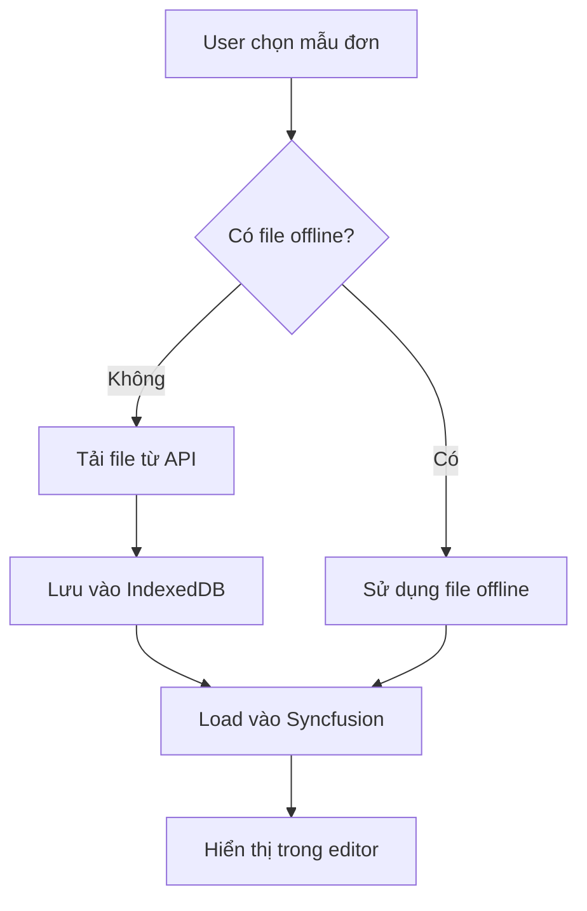

# Hệ thống tải và lưu trữ file offline

## Tổng quan

Hệ thống này cho phép tải file mẫu đơn từ API và lưu trữ cục bộ trong IndexedDB để sử dụng offline, sau đó load vào DocumentEditorContainerComponent trong template-filler.

## Cách hoạt động

### 1. Tải file từ API

Khi người dùng chọn một mẫu đơn từ API:

1. **Kiểm tra file có sẵn offline**: Hệ thống kiểm tra xem file đã được tải về IndexedDB chưa
2. **Tải file nếu cần**: Nếu chưa có, hệ thống sẽ tải file từ URL `http://laptrinhid.qlns.vn/uploads/tthc/{DuongDanTepDinhKem}`
3. **Lưu vào IndexedDB**: File được lưu trữ trong bảng `thanhPhanHoSoTTHCLocal`
4. **Load vào Syncfusion**: File được load vào DocumentEditorContainerComponent

### 2. Cấu trúc dữ liệu

#### ThanhPhanHoSoTTHCLocal (IndexedDB)
```typescript
interface ThanhPhanHoSoTTHCLocal {
    id?: number; // Auto-increment primary key
    thanhPhanHoSoTTHCID: string; // Reference to ThanhPhanHoSoTTHC
    duongDanTepDinhKem: string; // Original file path from API
    tenTepDinhKem: string; // Original file name
    downloadUrl: string; // Complete download URL
    blob: Blob; // File content as blob
    mimeType: string; // File MIME type
    downloadedAt: number; // Timestamp when downloaded
    fileSize: number; // File size in bytes
}
```

### 3. Các method chính

#### ThanhPhanHoSoTTHCRepository

- `downloadAndStoreFile(item)`: Tải và lưu file vào IndexedDB
- `downloadFileById(id)`: Tải file theo ID
- `getFileBlobForUse(id)`: Lấy file blob (tải nếu chưa có)
- `hasLocalFile(id)`: Kiểm tra file có sẵn offline
- `getStorageStats()`: Lấy thống kê storage

#### Template Filler

- `handleApiTemplateSelect()`: Xử lý khi chọn mẫu từ API
- `loadTemplateIntoSyncfusion()`: Load mẫu vào Syncfusion editor
- `refreshOfflineFiles()`: Refresh thông tin file offline

### 4. Luồng xử lý



### 5. Tính năng

#### Tự động tải file
- Khi chọn mẫu đơn, hệ thống tự động tải file nếu chưa có
- Pre-download tất cả file của thủ tục để cải thiện hiệu suất

#### Validation file
- Kiểm tra kích thước file (tối đa 50MB)
- Kiểm tra loại file (docx, doc, pdf, txt)
- Hiển thị cảnh báo cho file type không mong đợi

#### UI indicators
- Hiển thị số lượng file offline đã tải
- Hiển thị tổng dung lượng storage
- Thông báo trạng thái tải file

#### Error handling
- Fallback về API trực tiếp nếu tải offline thất bại
- Retry mechanism cho download
- Detailed error messages

### 6. Cấu hình

#### Base URL
```typescript
private baseDownloadUrl = 'http://laptrinhid.qlns.vn/uploads/tthc/';
```

#### File size limit
```typescript
const maxSize = 50 * 1024 * 1024; // 50MB
```

#### Allowed file types
```typescript
const allowedTypes = [
    'application/vnd.openxmlformats-officedocument.wordprocessingml.document', // .docx
    'application/msword', // .doc
    'application/pdf', // .pdf
    'text/plain' // .txt
];
```

### 7. Sử dụng

1. **Chọn mẫu đơn**: Click vào mẫu đơn từ danh sách API
2. **Tự động tải**: Hệ thống sẽ tự động tải file nếu chưa có
3. **Sử dụng offline**: Lần sau sẽ sử dụng file đã tải về
4. **Theo dõi storage**: Xem thống kê file offline trong header

### 8. Troubleshooting

#### File không tải được
- Kiểm tra kết nối internet
- Kiểm tra URL file có hợp lệ
- Xem console log để debug

#### File quá lớn
- File vượt quá 50MB sẽ bị từ chối
- Cần tối ưu file hoặc tăng limit

#### Storage đầy
- IndexedDB có giới hạn storage
- Có thể clear cache để giải phóng dung lượng

